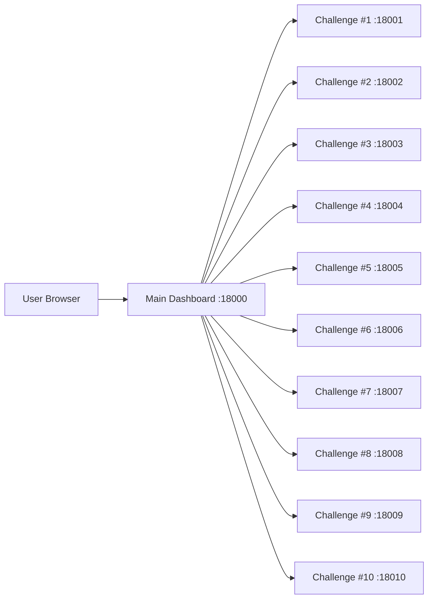

# PortSwigger Top 10 2025 Playground

[English (Default)](./README.md)


PortSwigger **Top 10 Web Hacking Techniques of 2025**를 기반으로 제작한 로컬 워게임/실습 저장소입니다.  
시나리오별 취약 환경을 Docker로 분리하고, 메인 대시보드에서 인스턴스 제어 및 플래그 제출을 수행할 수 있도록 구성했습니다.

---

## 개요

이 프로젝트는 다음 목적을 위해 설계되었습니다.

- 최신 웹 취약점 트렌드 기반 실습 환경 제공
- 교육/스터디/팀 훈련에 바로 사용할 수 있는 재현 가능한 랩 제공
- 시나리오별 독립 실행 + 대시보드 기반 통합 운영

---

## 환경 요구사항

- Docker
- Docker Compose v2 (`docker compose`)
- (권장) 메모리 8GB 이상

---

## Quick Start

```bash
git clone <your-repo-url>
cd portiswagger_top10_playground
docker compose up -d --build
```

실행 후 접속:

- **Dashboard**: http://localhost:18000

플레이 흐름:

1. 챌린지 카드 선택
2. 인스턴스 시작
3. 실습 진행
4. 플래그 제출

---

## 챌린지 매트릭스

| # | Technique | Directory | Access Port | Status |
|---|---|---|---:|---|
| 1 | Successful Errors | `1_successful_errors` | 18001 | ✅ Ready |
| 2 | ORM Leaking | `2_orm_leaking` | 18002 | ✅ Ready |
| 3 | Novel SSRF | `3_novel_ssrf` | 18003 | ✅ Ready |
| 4 | Unicode Normalization | `4_unicode_normalization` | 18004 | ✅ Ready |
| 5 | SOAPwn pwning .NET | `5_soapwn_pwning_NET` | 18005 | 🚧 Placeholder |
| 6 | Cross-site ETag | `6_cross-site_ETag` | 18006 | ✅ Ready |
| 7 | Next.js Cache | `7_Next.js_cache` | 18007 | ✅ Ready |
| 8 | XSS Leak | `8_xss_leak` | 18008 | ✅ Ready |
| 9 | HTTP/2 CONNECT | `9_HTTP2_CONNECT` | 18009 | ✅ Ready |
| 10 | Parser Differentials | `10_parser_differentials/Training-Environment---Parser-Differentials-main` | 18010 | ✅ Ready |

---

## 개별 실행 방법

### 일반 실행

```bash
cd <challenge-directory>
docker compose up -d --build
```

### 종료

```bash
docker compose down
```

### #10 Parser Differentials 실행 예시

```bash
cd 10_parser_differentials/Training-Environment---Parser-Differentials-main
docker compose up -d --build
```

---

## 아키텍처



---

## 스크린샷

아래 경로에 이미지 파일을 추가해서 사용할 수 있습니다.

- `docs/assets/dashboard.png`
- `docs/assets/challenge-modal.png`
- `docs/assets/sample-exploit-flow.png`

예시:

```md

```

---

## 디렉토리 구조

```text
.
├── 0_main_page/                # 통합 대시보드 (Flask)
├── 1_successful_errors/
├── 2_orm_leaking/
├── 3_novel_ssrf/
├── 4_unicode_normalization/
├── 5_soapwn_pwning_NET/        # Placeholder
├── 6_cross-site_ETag/
├── 7_Next.js_cache/
├── 8_xss_leak/
├── 9_HTTP2_CONNECT/
├── 10_parser_differentials/
└── docker-compose.yml           # 대시보드 실행용 compose
```

---

## 운영 TODO

- [ ] #5 (`5_soapwn_pwning_NET`) 실제 시나리오 구현
- [ ] 공통 난이도/힌트 정책/예상 풀이 시간 문서화
- [ ] `docs/assets/` 스크린샷 자산 정리

---

## Legal / Disclaimer

본 저장소는 **교육 및 연구 목적**으로만 제공됩니다.  
실제 서비스 또는 제3자 시스템에 대한 무단 테스트에 사용하지 마세요.
