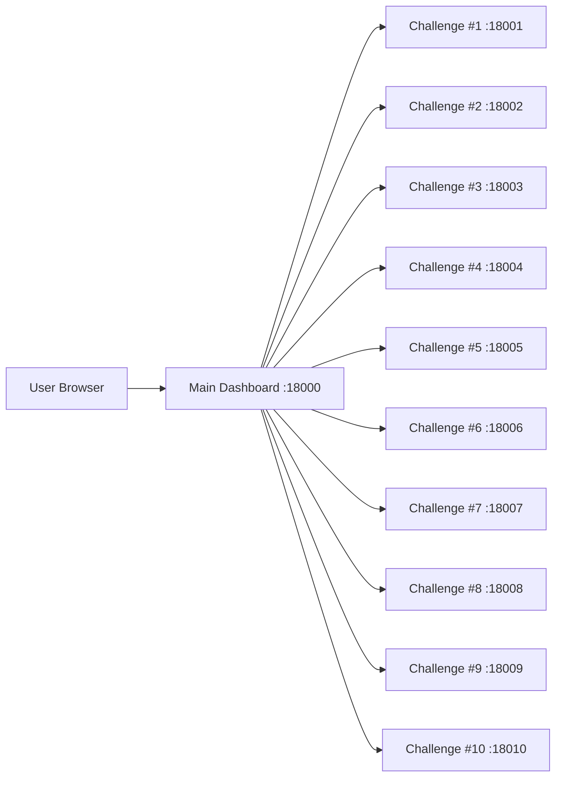

# PortSwigger Top 10 2025 Playground

[한국어 문서 (Korean)](./README-KR.md)


A local CTF/wargame playground based on **PortSwigger Top 10 Web Hacking Techniques of 2025**.  
Each challenge is isolated with Docker, and the main dashboard lets you start/stop instances and submit flags.

---

## Overview

This repository is designed for:

- Hands-on practice with modern web exploitation techniques
- Reproducible lab environments for classes, study groups, and team training
- Per-challenge isolation with centralized dashboard control

---

## Requirements

- Docker
- Docker Compose v2 (`docker compose`)
- (Recommended) 8GB+ RAM

---

## Quick Start

```bash
git clone <your-repo-url>
cd portiswagger_top10_playground
docker compose up -d --build
```

Then open:

- **Dashboard**: http://localhost:18000

Play flow:

1. Choose a challenge card
2. Start the instance
3. Exploit and retrieve the flag
4. Submit the flag

---

## Challenge Matrix

| # | Technique | Directory | Access Port | Status |
|---|---|---|---:|---|
| 1 | Successful Errors | `1_successful_errors` | 18001 | ✅ Ready |
| 2 | ORM Leaking | `2_orm_leaking` | 18002 | ✅ Ready |
| 3 | Novel SSRF | `3_novel_ssrf` | 18003 | ✅ Ready |
| 4 | Unicode Normalization | `4_unicode_normalization` | 18004 | ✅ Ready |
| 5 | SOAPwn pwning .NET | `5_soapwn_pwning_NET` | 18005 | 🚧 Placeholder |
| 6 | Cross-site ETag | `6_cross-site_ETag` | 18006 | ✅ Ready |
| 7 | Next.js Cache | `7_Next.js_cache` | 18007 | ✅ Ready |
| 8 | XSS Leak | `8_xss_leak` | 18008 | ✅ Ready |
| 9 | HTTP/2 CONNECT | `9_HTTP2_CONNECT` | 18009 | ✅ Ready |
| 10 | Parser Differentials | `10_parser_differentials/Training-Environment---Parser-Differentials-main` | 18010 | ✅ Ready |

---

## Run Challenges Manually

### Generic

```bash
cd <challenge-directory>
docker compose up -d --build
```

### Stop

```bash
docker compose down
```

### Challenge #10 Example

```bash
cd 10_parser_differentials/Training-Environment---Parser-Differentials-main
docker compose up -d --build
```

---

## Architecture



---

## Repository Structure

```text
.
├── 0_main_page/                # Main dashboard (Flask)
├── 1_successful_errors/
├── 2_orm_leaking/
├── 3_novel_ssrf/
├── 4_unicode_normalization/
├── 5_soapwn_pwning_NET/        # Placeholder
├── 6_cross-site_ETag/
├── 7_Next.js_cache/
├── 8_xss_leak/
├── 9_HTTP2_CONNECT/
├── 10_parser_differentials/
└── docker-compose.yml           # Dashboard compose
```
---

## Legal / Disclaimer

For **educational and research purposes only**.  
Do not use this project to test unauthorized real-world systems.
